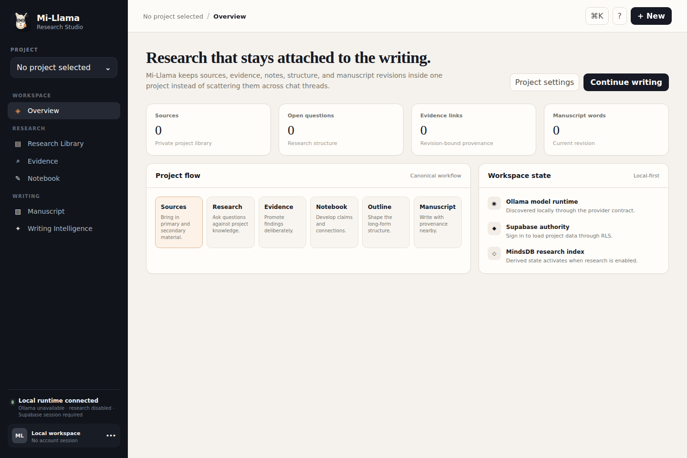
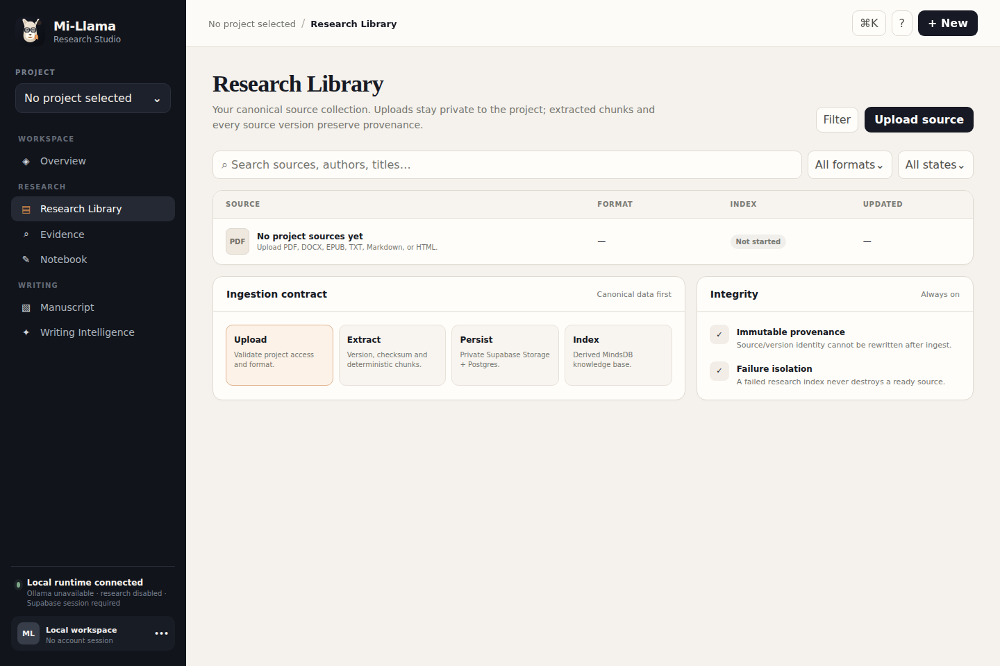
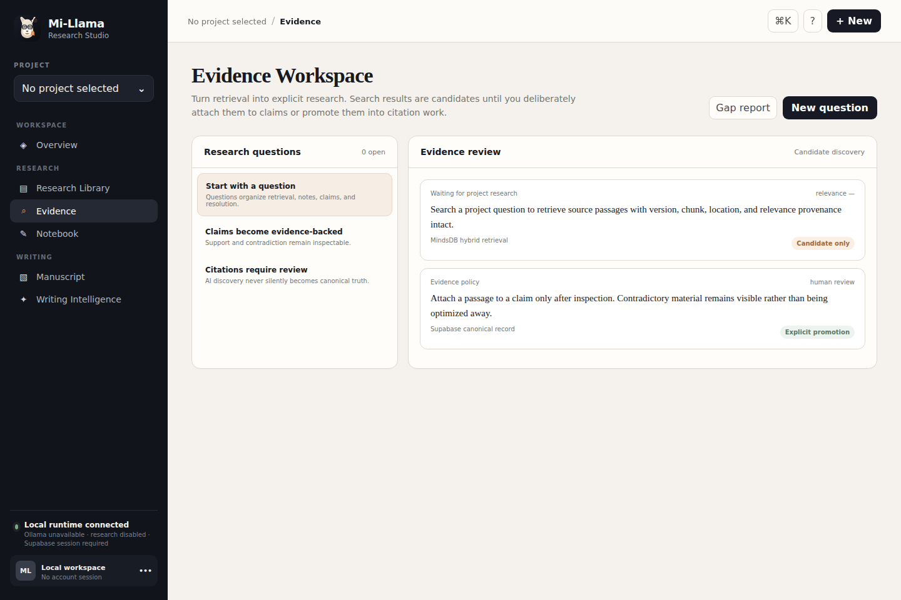
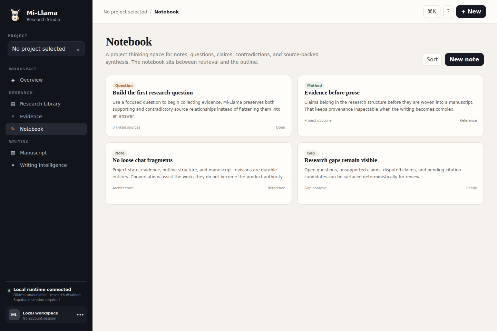
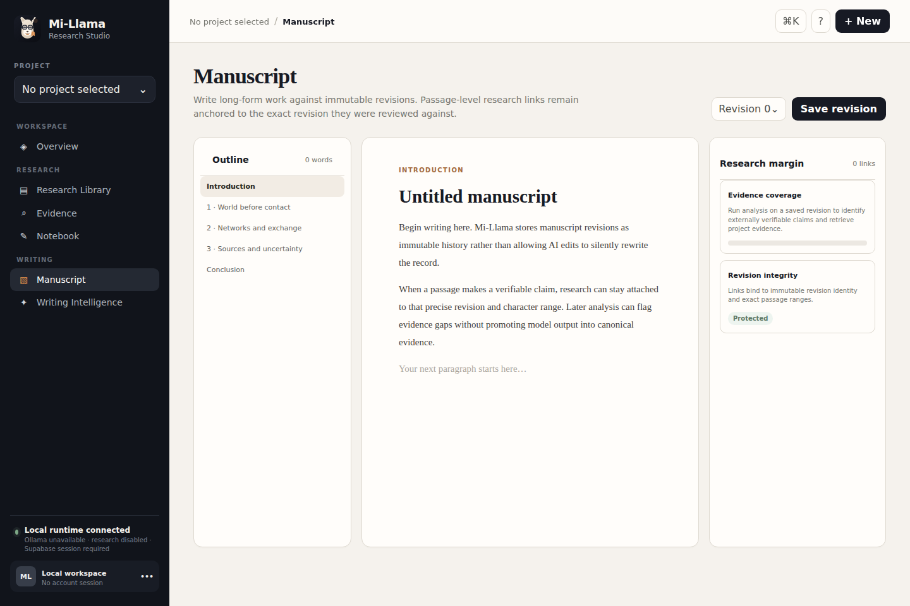
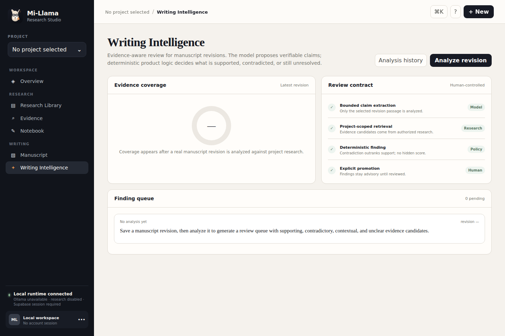

# Mi-Llama

**Mi-Llama is an AI research and writing studio for evidence-grounded long-form work.**

The product is focused on writers, researchers, educators, analysts, and teams whose work starts with sources and ends in serious written output: books, articles, research, lessons, reports, white papers, briefs, and internal knowledge.

Mi-Llama's center of gravity is a **Project**, not a chat thread.

```text
Project -> Sources -> Research -> Evidence -> Notebook -> Outline -> Manuscript -> Publication
```

## Product identity


Mi-Llama now uses a persona-led identity: a calm llama research companion with reading glasses and an evidence/bookmark accent. The canonical visual assets live in [`docs/assets/`](docs/assets/), with usage rules in [`docs/BRAND.md`](docs/BRAND.md).

## Product tour

These are captures from the repository-owned Mi-Llama workspace shell, not generated UI mockups. The capture contract and refresh rules live in [`docs/PRODUCT_MEDIA.md`](docs/PRODUCT_MEDIA.md).

| Project overview | Research Library |
| --- | --- |
|  |  |
| **Evidence workspace** | **Notebook** |
|  |  |
| **Manuscript** | **Writing Intelligence** |
|  |  |

## Current foundation

The current development line provides:

- a typed Python/FastAPI application core
- a repository-owned consumer workspace shell served by the normal Mi-Llama runtime
- native Ollama model discovery, chat, and token streaming behind a provider contract
- Supabase/Postgres as the canonical product-data authority
- Supabase JWT propagation so Row Level Security evaluates the real caller
- project ownership and role-based membership
- project-scoped conversations and messages
- append-oriented learning signals for future ranking/evidence/personalization ML
- a private, project-scoped Research Library in Supabase Storage
- PDF, DOCX, EPUB, TXT, Markdown, and HTML extraction
- deterministic chunking, checksums, source versions, and duplicate detection
- immutable source/version provenance fields
- project-scoped MindsDB knowledge bases for derived semantic/hybrid research indexes
- evidence hits that preserve source, source-version, chunk, ordinal, and location provenance
- explicit research indexing state and reindexing
- structured research questions, claims, notes, evidence relations, citation candidates, and gap reports
- hierarchical outlines, immutable manuscript revisions, and revision-bound research links
- evidence-aware manuscript analysis with explicit human review/promotion
- automated formatting, lint, strict type-check, and test gates

## Authority map

### Supabase

Supabase is durable truth for identity, projects, memberships, conversations, source metadata, source versions, extracted chunks, raw source objects, research structure, manuscript state, and learning signals.

The normal application runtime uses a publishable key plus the user's bearer token. It does **not** use a privileged service-role key for ordinary user operations.

### MindsDB

MindsDB is Mi-Llama's research-intelligence boundary. Each Project gets an isolated, UUID-derived knowledge-base namespace. MindsDB performs semantic/hybrid retrieval over derived research indexes.

The MindsDB index is **rebuildable derived state**, not canonical product data. A failed index must never destroy or invalidate a successfully ingested source in Supabase.

MindsDB never owns users, project permissions, manuscript persistence, billing, or source authorization. Mi-Llama verifies project access through Supabase before entering a MindsDB project namespace.

### Ollama

Ollama is the first local model runtime. It powers chat and structured writing analysis and, when MindsDB research is enabled, can provide the embedding model used by the research index.

## Requirements

- Python 3.11+
- a Supabase project with the migrations in `supabase/migrations/` applied
- Ollama running locally for local inference
- at least one chat model installed in Ollama
- MindsDB only when research indexing/querying is enabled
- an Ollama embedding model such as `nomic-embed-text` when using the default MindsDB embedding configuration

## Development setup

```bash
python -m venv .venv
source .venv/bin/activate
python -m pip install -e ".[dev]"
```

Configure runtime values:

```text
MI_LLAMA_HOST=127.0.0.1
MI_LLAMA_PORT=8765
MI_LLAMA_OLLAMA_BASE_URL=http://127.0.0.1:11434
MI_LLAMA_SUPABASE_URL=https://YOUR_PROJECT.supabase.co
MI_LLAMA_SUPABASE_PUBLISHABLE_KEY=YOUR_PUBLISHABLE_KEY
MI_LLAMA_REQUEST_TIMEOUT_SECONDS=60
MI_LLAMA_CONNECT_TIMEOUT_SECONDS=3

# Research indexing/querying
MI_LLAMA_MINDSDB_ENABLED=true
MI_LLAMA_MINDSDB_BASE_URL=http://127.0.0.1:47334
MI_LLAMA_MINDSDB_PROJECT=mi_llama
MI_LLAMA_MINDSDB_EMBEDDING_MODEL=nomic-embed-text
# Optional when MindsDB is remote/authenticated:
# MI_LLAMA_MINDSDB_API_TOKEN=...
# MI_LLAMA_MINDSDB_EMBEDDING_BASE_URL=http://host-visible-to-mindsdb:11434
```

Then run:

```bash
mi-llama
```

The consumer workspace is served at `/`. The FastAPI developer surface remains available at `/docs`.

## Research Library lifecycle

```text
Upload
  -> validate project access
  -> detect/parse source
  -> SHA-256 duplicate check
  -> create source + immutable version provenance
  -> upload raw object to private Supabase Storage
  -> persist deterministic chunks in Supabase
  -> mark source ready
  -> derive/update the Project MindsDB knowledge base
```

A source can be `ready` even if its research index is `failed`. That is deliberate: canonical research material must survive an embedding or MindsDB outage. The source can then be explicitly reindexed.

## API

Provider/runtime endpoints:

- `GET /health`
- `GET /api/provider/health`
- `GET /api/models`

Authenticated Project endpoints:

- `GET /api/projects`
- `POST /api/projects`
- `GET /api/projects/{project_id}`
- `GET /api/projects/{project_id}/conversations`
- `POST /api/projects/{project_id}/conversations`
- `GET /api/conversations/{conversation_id}`
- `POST /api/conversations/{conversation_id}/messages`
- `POST /api/projects/{project_id}/learning-signals`

Research Library endpoints:

- `GET /api/projects/{project_id}/sources`
- `POST /api/projects/{project_id}/sources` (multipart `file`)
- `GET /api/projects/{project_id}/sources/{source_id}`
- `POST /api/projects/{project_id}/sources/{source_id}/reindex`
- `POST /api/projects/{project_id}/research/query`

Structured research and writing routes are registered when the configured repository satisfies those capability contracts.

All project/source/research/writing endpoints require `Authorization: Bearer <supabase-access-token>`.

## Security invariants

- RLS is enabled on every exposed project/source/research/writing table.
- anonymous table access is explicitly revoked.
- raw source objects live in a private Supabase Storage bucket.
- Storage reads/uploads are project-scoped through RLS.
- ready raw source objects cannot be deleted through the normal application role.
- source and source-version provenance columns are immutable after creation.
- source chunks may only be inserted into a processing source version.
- ordinary application requests never use a Supabase secret/service-role key.
- MindsDB is entered only after Supabase confirms Project access.
- user content is SQL-escaped at the MindsDB boundary and Project/KB identifiers are generated internally.
- research evidence and manuscript revisions retain immutable provenance rather than allowing model output to rewrite history.

## Learning-ready, not ML-heavy

Mi-Llama captures meaningful decisions such as research-result saves/rejections, source trust choices, citation acceptance, AI-edit acceptance, writing-finding review, and research-suggestion acceptance. These events are behavioral evidence, not unquestionable ground truth. They form a future training/evaluation substrate for targeted ranking, evidence-verification, recommendation, and personalization models.

## Quality gate

```bash
ruff format --check .
ruff check .
mypy src/mi_llama
pytest
```

No feature is considered complete until its exact PR head passes the gate.

## Product roadmap

1. **Foundation**: modular API, Ollama provider, quality gates
2. **Project authority**: Supabase, RLS, membership, learning signals
3. **Research Library**: source ingestion, private Storage, source versions/chunks, provenance
4. **Research Intelligence**: MindsDB project KBs, hybrid retrieval, inspectable evidence
5. **Research Structure**: notebook, questions, claims, evidence, contradictions
6. **Writing Studio**: outline and manuscript editor
7. **Evidence-aware editing**: manuscript analysis, citation integrity, source-backed revision
8. **Consumer workspace**: project-centered browser shell and real product gallery
9. **Targeted ML**: ranking/evidence/recommendation models only where measured value justifies them
10. **Collaboration**: realtime team and education workflows
11. **Consumer release**: desktop packaging and clean-machine acceptance

See [`docs/ARCHITECTURE.md`](docs/ARCHITECTURE.md) for architectural contracts.

## License

MIT. See [LICENSE](LICENSE).
